## Admin in a day

# M03-HOL-Action through Automation

### Estimated Duration: 120 Minutes

## Lab Scenario

In this hands-on lab, you are an administrator supporting Contoso's efforts to streamline and control Power Platform usage. Contoso has restricted environment creation to global or service admins and wants an automated process for users to request new environments and Dataverse databases without discouraging platform adoption. You will build a Microsoft Form for users to submit requests, and then use Power Automate with administrative connectors and approval workflows to automate the review and provisioning process. The solution will handle approvals, environment creation, and user notifications. You’ll also explore the app auditing process from the CoE Starter Kit by stepping through it as both a maker and an admin, and install a prebuilt flow to identify new app makers, add them to an Office 365 group, and send them a welcome email.


## Lab Objectives

In this lab, you will complete the following exercises:

- Exercise 1 - Create Environment Request Form
- Exercise 2 – Create Environment on Form Submit

### Lab Test Environment

This hands-on lab is designed to be completed in an environment setup for multiple students to complete the Admin in a day series of hands-on labs.

You will be assigned one or more users to use to complete the hands-on tasks. Because this is a shared environment, some tasks that require a tenant Global Administrator or a Service 
Administrator will already be performed.

This lab does not require you to have completed any of the prior labs.

## Exercise 1: Create Environment Request Form

### Scenario

In this exercise, you will be creating an environment request form using Microsoft Forms. This form could
collect additional information allowing it to be tailored to your individual organization's requirements.

### Task 1: Create Microsoft Form

In this task you will, create a form titled New Environment Approval Request with required fields for Environment Name, Business Justification, and Connectors to be used, then preview the saved form.

1. Open a new tab and navigate to **Microsoft Forms** with the following link:

   ```
   https://forms.office.com/Pages/DesignPageV2.aspx?prevsubpage=design
   ```

2. On the **Welcome to Microsoft Forms!** page, select **Registration**.

   

3. Select the **Untitled Form** Header.

   

4. Enter **New Environment Approval Request (1)** for title, enter **New environment request (2)** for description, and select **+ Quick start with (3)**.

   

5. We will create the **Form**, as shown in the screenshot below, by following the steps outlined below.

   

6. Select **Text**.

   

7. Enter the **Environment Name (1)**, mark the question as **Required (2)** by enabling it, and select **+ Add new question (3)**.

   

8. Select **Text** again.

9. Enter **Business Justification (1)**, select **Long Answer (2)**, and mark it as **Required (3)**. Then, select **+ Add new question (4)**.

   

10. Select **Text**.

11. Enter **What connectors will you use? (1)**, select **Long Answer (2)**, and mark it as **Required (3)**.


   

12. The form will be saved automatically.

13. Select **Preview**.

    

14. You can see the created form.

    


## Exercise 2: Create Environment on Form Submit

### Scenario

In this exercise, you will be building the automated flow to process new form submissions.

> **Note**: For this exercise, we have hard-coded the language, currency and environment template. The Power Platform Administration connector has actions allowing you to dynamically retrieve these and make the process more flexible. You could allow the user to specify the values, or infer them from the user’s Office 365 profile information using the Office 365 connector.

### Task 1: Delete your sandbox environment

In this task you will, remove the earlier sandbox environment to free up the trial slot.

1. Navigate back to the **Power Platform admin center** page.

1. On the **Environment**, select the sandbox environment that you created in module one named **My Sandbox-<inject key="Deployment ID" enableCopy="false" />** in the list of environments.

   

1. Select the **Delete** button.

   

1. Confirm the deletion by typing the environment name **My Sandbox-<inject key="Deployment ID" enableCopy="false" /> (1)** and then select **Confirm (2)**. We have to delete it to create another Trial environment, which we can only have one at a time.

   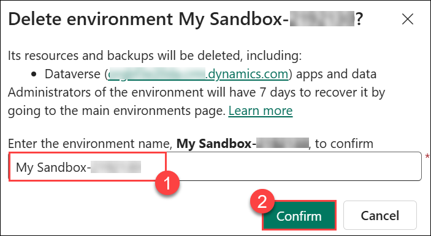

   >**Note**: Environment deletion may take some time. Please wait until it is fully deleted, and keep refreshing the portal until the process is complete.

### Task 2: Create New Environment Approval Flow

In this task you will, build a flow triggered by form submissions that requests approval and conditionally creates a new environment.

1. Navigate back to the **Power Automate** portal page.

1. Set your environment to **Power Platform CoE**.

   >**Note**: This environment is where our CoE starter kit is installed and is intended to be our dedicated admin environment. Even if you don’t use the starter kit, having a dedicated 
   admin environment can be helpful.

   

1. On the left navigation menu, select **My flows (1)**, select **+ New flow (2)** drop down and select **Automated cloud flow (3)**.

   

1. Type **New Environment Approval (1)** in the **Flow name** field. In the **Choose your flow’s trigger** section, search for **When a new response is submitted (2)** then select **When a new response is submitted (3)**, and select **Create (4)**.

   

1. Select the **When a new response is submitted** box.

   

1. For the **Form Id**, select the **New Environment Approval Request** form which you created.

   

1. Select **+ Add action**.

   

1. Search for **Microsoft Forms (1)** and select **Get response details (2)**.

   

1. Click on the **Get response details** and select **New Environment Approval Request (1)** for **Form Id** and click on the **dynamic content (2)** symbol to select **Response Id**. 

    

    >**Note:** Please signin with ODL user credentials if prompted.

1. Select the **Response Id** from the Dynamic content pane.    

    

1. Select **+ Add action**.

    

1. Search for **Approvals (1)** and select **Start and Wait for an approval (2)**.

    

1. If prompted, click on **Create new**.

1. Select **Approve/Reject - First to Respond** for Approval type.

    

1. Enter **Environment Approval Requested (1)** for Title.

   - Select the user you are logged in as for **Assigned to** by typing the **<inject key="AzureAdUserEmail"></inject>** into the field and selecting the correct dropdown item **(2)**

   - Type **New Environment was requested by:** in the **Details** field **(3)**

   - Select the Dynamic content symbol to select the Responder email **(4)**

        

   - Select **Responders Email** from the Dynamic content pane.

     

1. Hit the enter key and type **Environment Name:** and select **Environment Name** from the Dynamic content pane.

    

1. Hit the enter key again and type **Business Justification:** and select **Business Justification** from the Dynamic content pane.

    

1. Hit the enter key again type **Connectors:** and select **What connectors will you use?** from the Dynamic content pane.

    

1. Select **+ Add Action** under **Start and Wait for an Approval**.

    

1. Search for **Condition (1)** and the select **Condition (2)** Control.

    

1. Click on the dynamic content symbol to select the Value.

    

1. Select the Choose a value field and select **Outcome**.

    

1. Enter **is equals (1)** to for condition, enter **Approve (2)** for value.

    

1. Select **Add an action** in the **True**  branch.

    

1. Search for **Power Platform for Admins** and under **Power Platform for Admins** section select **See more (2)**.

    

1. Select **Create Environment**.

    

1. Click on **Sign in**, if prompted. Sign in with your lab credentials.

    

1. Select **United States (1)** for the **Location** and select the dynamic content symbol on the **Display Name** field **(2)**.

    

    >**Note:** Location determines the region for the environment, in a real process you might allow this to be auto-determined by the user location or something the requester provides.

1. Select **Environment Name** from the Dynamic content pane.

    

     >**Note**: Enter **/ (1)** and select **Insert dynamic content (2)** to get the dynamic values.

1. Select **Trial** for **Environment Sku**.

    

1. Select **Save**. Do not navigate away from this page.

    

### Task 3: Create a Database and Notify the User

In this task you will, extend the flow to provision a CDS database and send approval/rejection notification emails.

1. Select **+ Add an action** under **Create Environment**.

   

1. Search for **Power Platform for Admins** and under **Power Platform for Admins** section select **See more (2)**.

    

1. Select **Create CDS Database**.

    

1. Select an existing connection.

   

1. Select on the **Environment (1)** dropdown and select **Enter Custom Value (2)**.

   

1. Enter **/ (1)** and select **Insert dynamic content (2)** to get the dynamic values.  

   

1. Select **Name** from the Dynamic content pane.

   

1. Select **Show all (2)**.

   

1. Enter **1033 (1)** for Base Language and enter **USD (2)** for Currency Code.

    - Enter **D365_CDSSampleApp (3)** for Template Item.

      

1. Select **Add an action** under **Create CDS Databse**.

   

1. Search for **Send Email (1)** and select **Send an email (V2) (2)**.

   

1. Click on **Sign in**. Sign in with the lab credentials.

   

1. Click on Settings dropdown **(1)** and then select **Use dynamic content (2)**.

   

1. Select on the **To:** field and select **Responders Email** for the Dynamic Content pane **(1)**.

1. Enter **Your environment was created** for **Subject (2)**.

1. Enter **Environment:** in the **Body** field and select **Display Name** from the Dynamic Content pane under the **Create Environment** step and add **was created** in the last **(3)**.

1. Your email should look like the image below.

    

1. Go to the **False** branch and select **Add an Action** to create a new connection under the **False** branch.

   

1. Search for Send email and select **Send an email (V2)**.

   

1. Click on Settings dropdown **(1)** and then select **Use dynamic content (2)**.

   

1. Select on the **To:** field and select **Responder’s Email** from the Dynamic Content pane.

   

1. Type **Rejected environment request (1)** for **Subject**.

1. Enter **Your request for new environment was rejected (2)** in the **Body**.

1. Your email should now look like the image below.

    

1. Select **Save**.

    

1. Select **Flow checker** and make sure there are no errors.

    

    

1. Close the **Flow checker** pane with the X to the right of the pane header.

1. Select the **Back** button.

    

### Task 4: Test the Flow

In this task you will, submit the form, approve the request via email, and verify that the new environment is created successfully in the admin center.

1. Navigate to **Microsoft Forms** and open the form you created.

   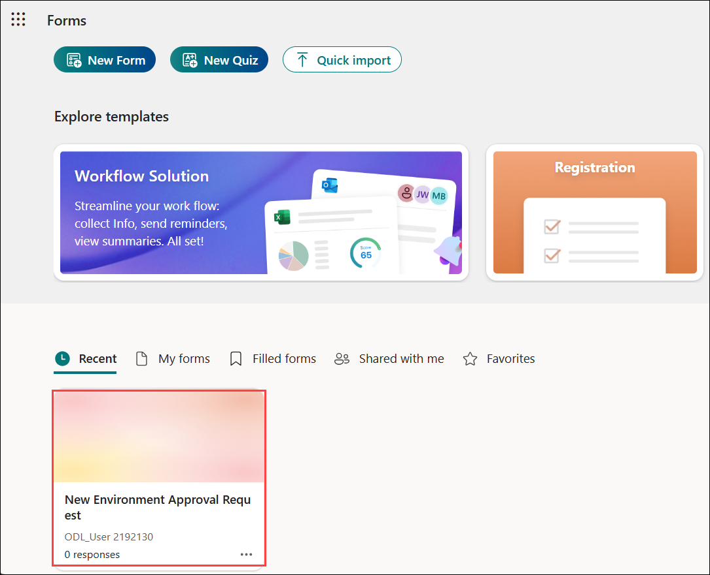

1. Select **Collect responses**.

   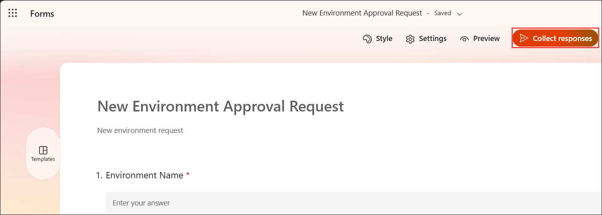

1. Select **Copy link** button.   

   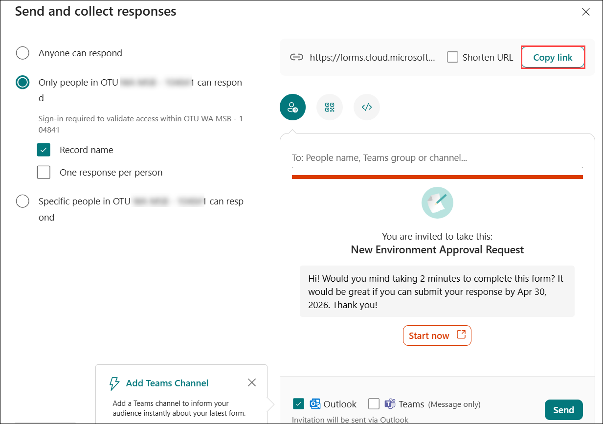

1. Paste the link in the browser and navigate to the create form.

   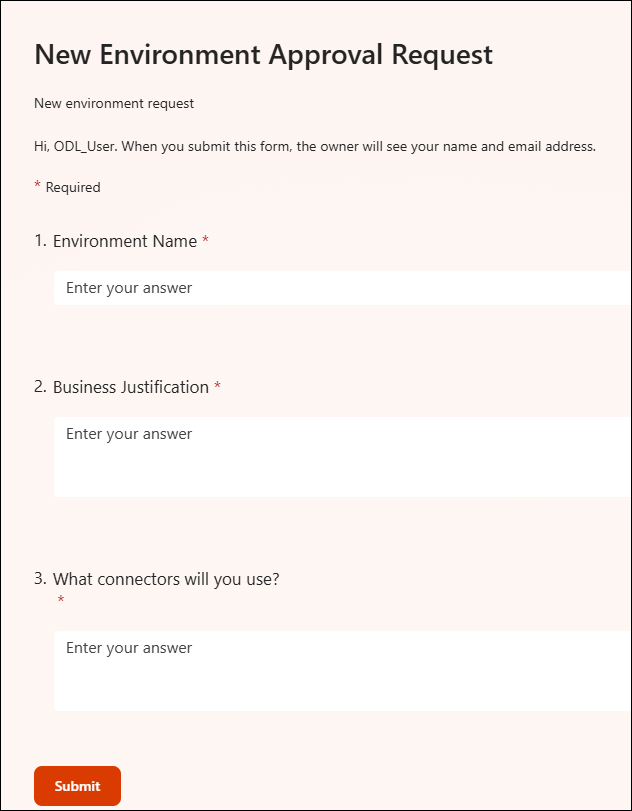

1. The form should load, provide the following details and then click on **Submit (4)**.

   - Environment name: Provide **Central Apps Test (1)**
   - Business Justification: **We will use this Environment for training new employees (2)**
   - What connector will you use: **Microsoft Dataverse (3)**. 

         
   
      >**Note**: For this course, we will be using this environment we created here later in another lab to deploy the Device Ordering solution using Azure Dev Ops, for that lab it will serve as the Test environment which is why we are suggesting naming it Central Apps Test. In real word use, most likely it would be a team/project development environment that would be requested using a form like this.

1. Navigate back to the **Power Automate** portal, Go to **My flows (1)** list and open the flow you created **(2)**.

   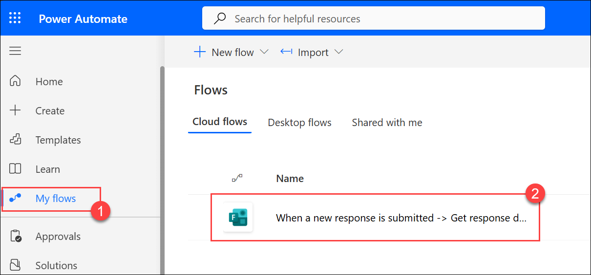

1. You should see the flow running. Select the start date to open it.

   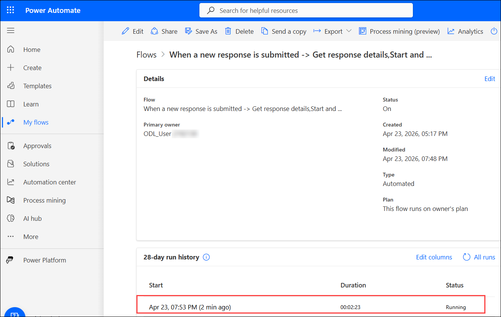

1. The flow is waiting for approval.

   

1. Navigate to Outlook. You should have an approval request email, select to open it.

    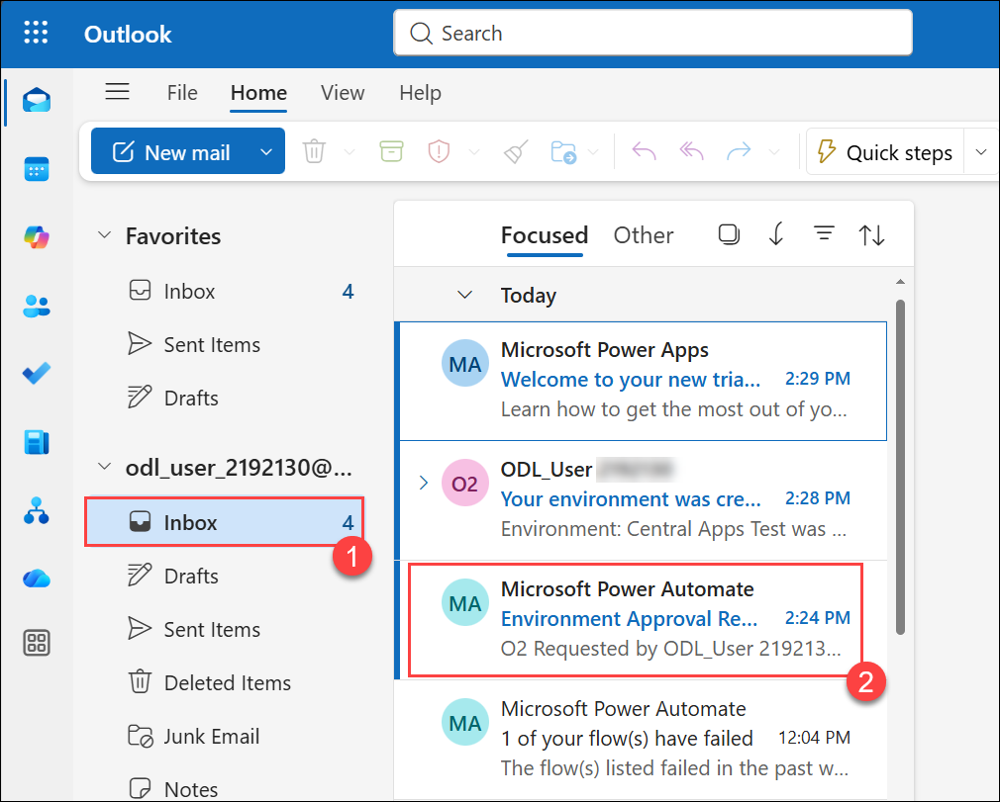

1. Select **Approve** to approve the request and select **Submit**.

    

1. Navigate back to the flow browser tab. The flow should succeed.

    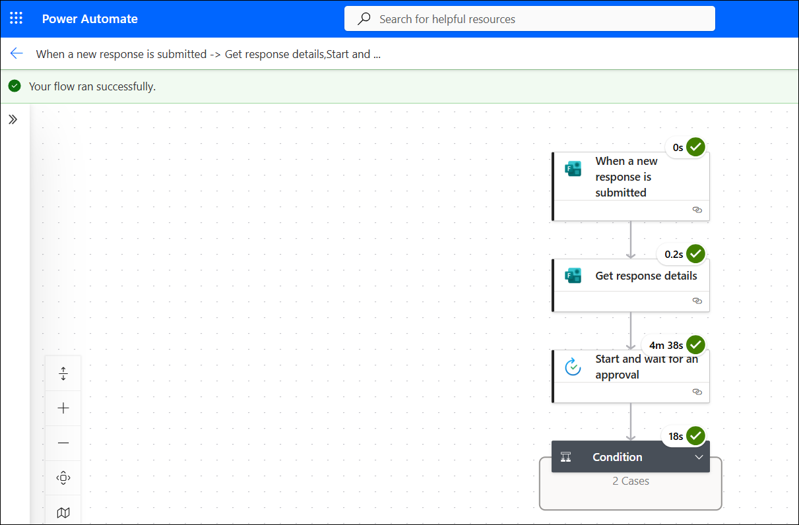

1. Navigate to the **Power Platform admin center**, and select **Environments (1)**. Click on **Refresh (2)** The new environment **Central Apps Test (3)** should be listed there.

    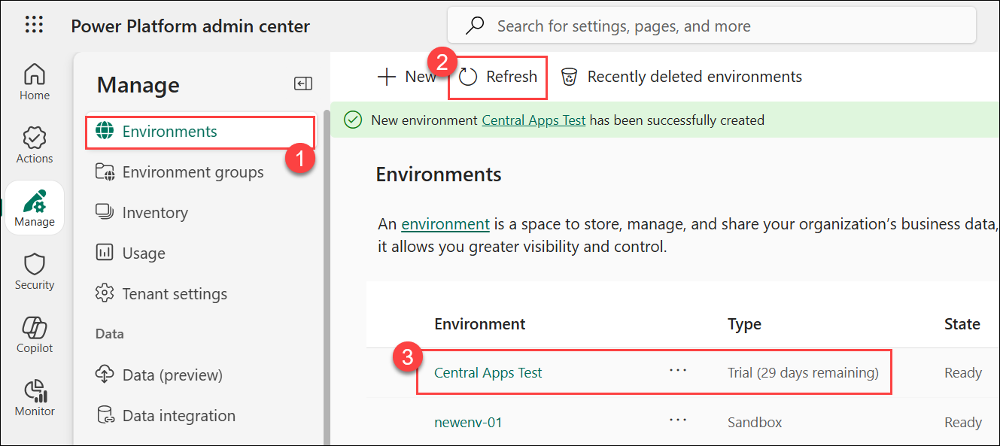

1. You should also get an email.
 
    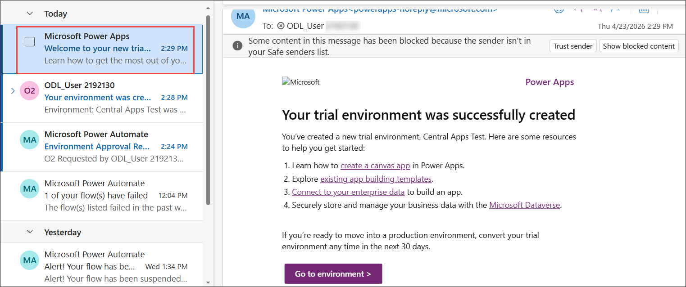

1. You may test for request rejection if you like.

### Review

In this lab, you have accomplished the following:

- Exercise 1 - Created Environment Request Form
- Exercise 2 – Created Environment on Form Submit

### You have successfully completed this module. Click **Next** from the lower right corner to move on to the next page.


